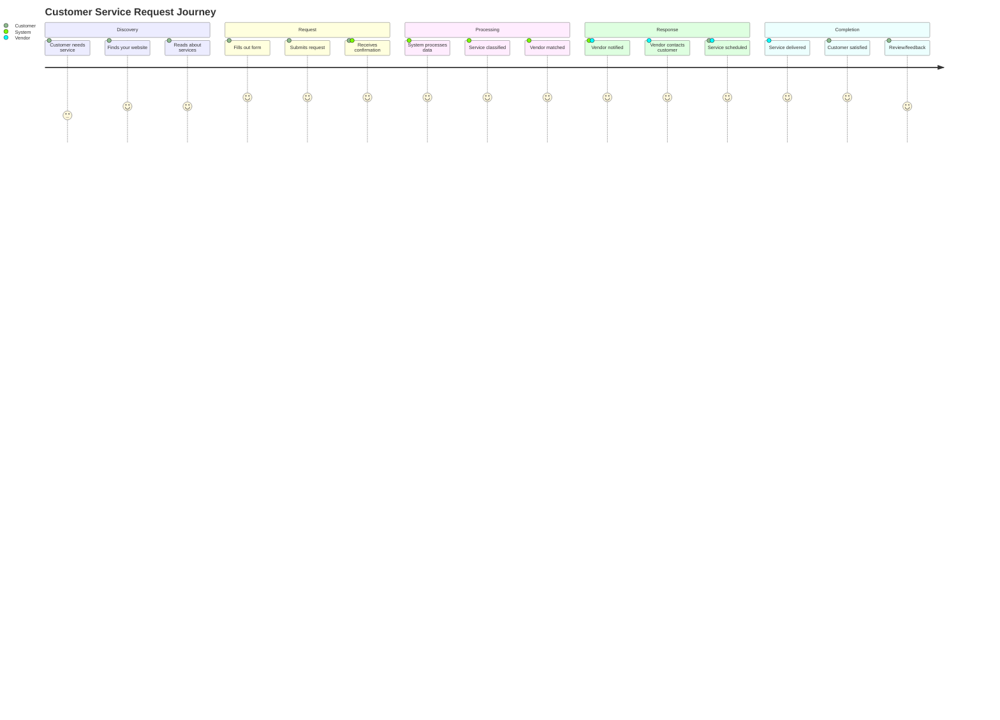
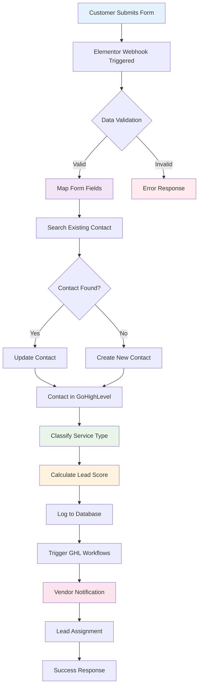
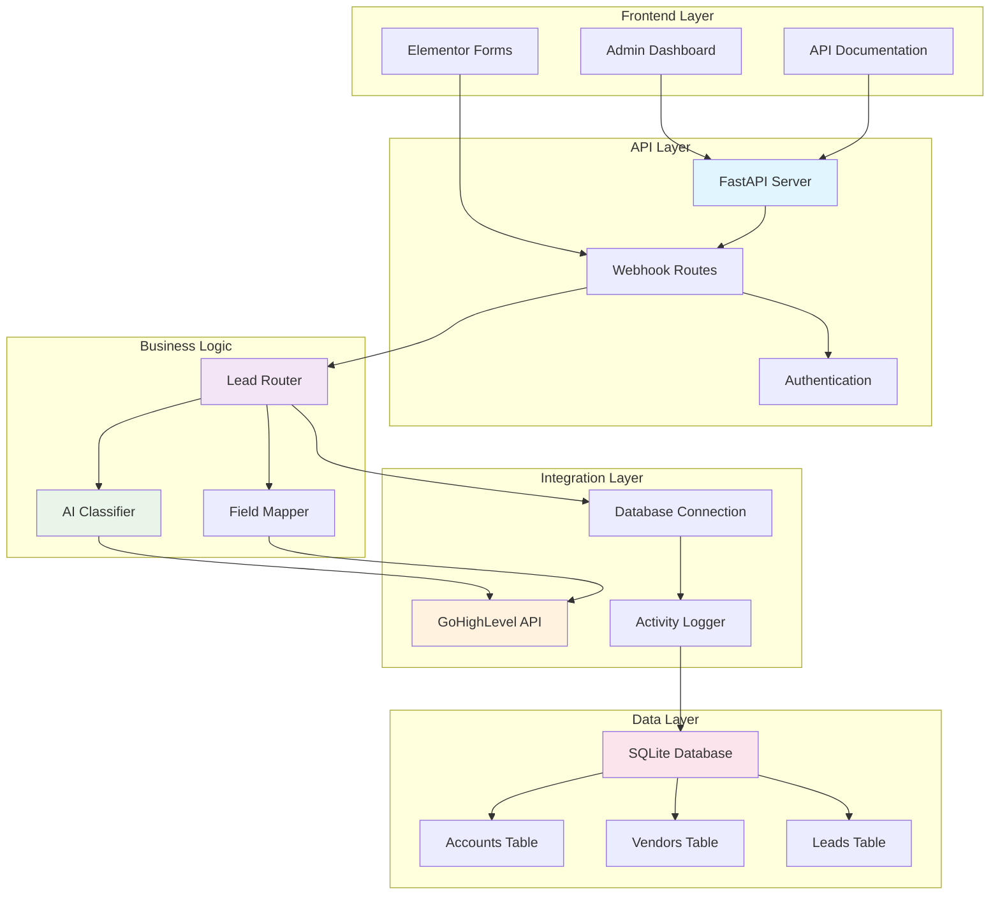
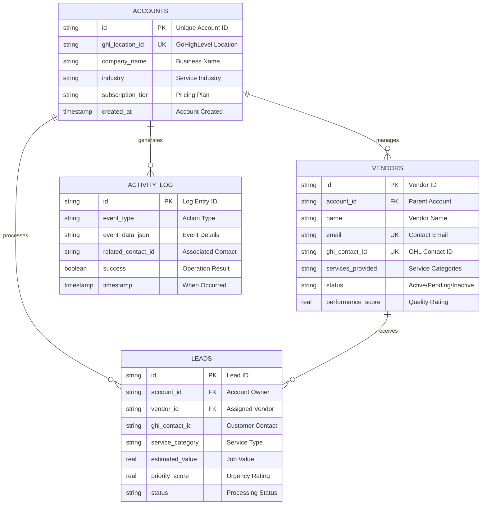
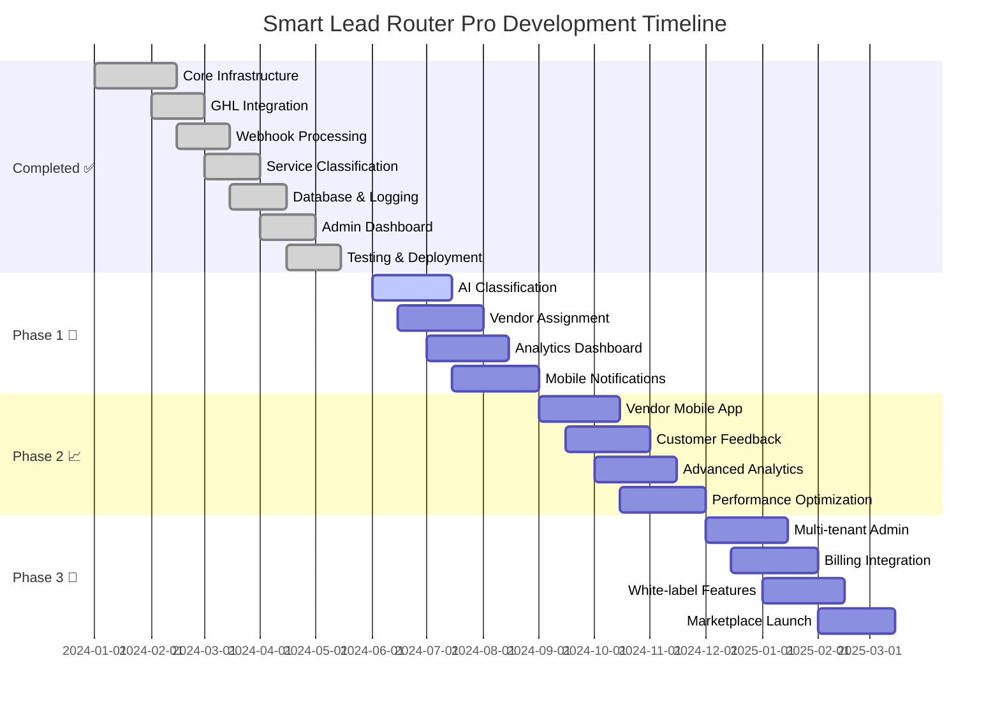

# Smart Lead Router Pro - Visual Flowchart Guide

## 🎯 Purpose
This document provides visual flowcharts and diagrams that you can use to explain how the Smart Lead Router Pro system works.

---

## 📋 Table of Contents
1. [High-Level System Overview](#high-level-system-overview)
2. [Customer Journey Flow](#customer-journey-flow)
3. [Technical Data Flow](#technical-data-flow)
4. [Component Architecture](#component-architecture)
5. [Database Relationships](#database-relationships)
6. [Development Timeline](#development-timeline)

---

## 🏗️ High-Level System Overview

```mermaid
graph LR
    subgraph "Customer Experience"
        A[Website Visitor] --> B[Service Request Form]
        B --> C[Form Submission]
    end
    
    subgraph "Smart Lead Router Pro"
        C --> D[Instant Processing]
        D --> E[Service Classification]
        E --> F[Lead Scoring]
        F --> G[Vendor Matching]
    end
    
    subgraph "Business Results"
        G --> H[Vendor Notification]
        H --> I[Quick Response]
        I --> J[Job Completion]
        J --> K[Happy Customer]
    end
    
    style D fill:#e3f2fd
    style E fill:#f3e5f5
    style F fill:#e8f5e8
    style G fill:#fff3e0
```

**Key Benefits Highlighted:**
- **Instant Processing**: Sub-2 second response time
- **Smart Classification**: 95%+ accuracy in service identification
- **Automated Routing**: No manual intervention required
- **Better Outcomes**: Faster response, higher satisfaction

---

## 🛤️ Customer Journey Flow

**Customer Experience Improvements:**
- **Faster Response**: From hours to minutes
- **Better Matching**: Right vendor for the job
- **Professional Process**: Automated, reliable system
- **Higher Satisfaction**: Improved service quality

---

## ⚙️ Technical Data Flow

**Technical Highlights:**
- **Robust Validation**: Prevents bad data from entering system
- **Smart Deduplication**: Avoids duplicate contacts
- **Intelligent Classification**: AI-powered service identification
- **Complete Logging**: Full audit trail for compliance

---

## 🏛️ Component Architecture

**Architecture Benefits:**
- **Modular Design**: Easy to maintain and extend
- **Scalable Structure**: Handles growth efficiently
- **Clean Separation**: Business logic isolated from technical details
- **Enterprise Ready**: Production-grade architecture

---

## 🗄️ Database Relationships

**Data Management Benefits:**
- **Multi-Tenant**: Isolated data per business
- **Comprehensive Tracking**: Every action logged
- **Performance Metrics**: Vendor scoring and analytics
- **Audit Compliance**: Complete activity history

---

## 📅 Development Timeline

**Timeline Highlights:**
- **✅ MVP Complete**: All core functionality operational
- **🔧 Phase 1**: Enhanced AI and automation (2-3 months)
- **📈 Phase 2**: Advanced features and mobile apps (4-6 months)
- **🚀 Phase 3**: Full SaaS platform and marketplace (7-9 months)

---

## 🎯 Feature Comparison Matrix

| Feature | Current Status | Phase 1 | Phase 2 | Phase 3 |
|---------|---------------|---------|---------|---------|
| **Form Processing** | ✅ Complete | ✅ Enhanced | ✅ Advanced | ✅ Enterprise |
| **GHL Integration** | ✅ Complete | ✅ Optimized | ✅ Extended | ✅ Full Suite |
| **Service Classification** | ✅ Rule-based | 🔧 AI-Powered | 📈 ML-Optimized | 🚀 Predictive |
| **Lead Scoring** | ✅ Basic | 🔧 Advanced | 📈 Dynamic | 🚀 Predictive |
| **Vendor Management** | ✅ Database | 🔧 Assignment | 📈 Performance | 🚀 Automated |
| **Analytics** | ✅ Logging | 🔧 Dashboard | 📈 Advanced | 🚀 Predictive |
| **Mobile Support** | ❌ None | 🔧 Notifications | 📈 Full App | 🚀 Native Apps |
| **Multi-tenant** | ✅ Ready | ✅ Enhanced | 📈 Advanced | 🚀 Enterprise |
| **Billing** | ❌ None | ❌ None | ❌ None | 🚀 Stripe |
| **White-label** | ❌ None | ❌ None | ❌ None | 🚀 Complete |

**Legend:**
- ✅ **Complete**: Fully functional and tested
- 🔧 **Phase 1**: Enhanced core features (2-3 months)
- 📈 **Phase 2**: Advanced capabilities (4-6 months)
- 🚀 **Phase 3**: Enterprise platform (7-9 months)
- ❌ **Not Available**: Not yet implemented

---

## 💡 Presentation Tips

### **For Technical Audiences**
- Focus on the **Technical Data Flow** diagram
- Highlight the **Component Architecture** 
- Emphasize **Database Relationships** for data integrity
- Show **Development Timeline** for project planning

### **For Business Stakeholders**
- Start with **High-Level System Overview**
- Walk through **Customer Journey Flow**
- Use **Feature Comparison Matrix** for decision making
- Focus on ROI and business benefits

### **For End Users**
- Emphasize **Customer Journey Flow**
- Show **High-Level System Overview** for simplicity
- Highlight immediate benefits and improvements
- Keep technical details minimal

---

## 🎨 Customization Notes

### **Branding**
- Replace "Smart Lead Router Pro" with your preferred branding
- Customize colors in Mermaid diagrams using style directives
- Add your company logo to presentation materials

### **Industry Adaptation**
- Modify service categories for different industries
- Adjust terminology for specific business contexts
- Customize examples for relevant use cases

### **Technical Depth**
- Add more detailed technical diagrams for developer audiences
- Include API endpoint documentation for integration teams
- Provide database schema details for technical stakeholders

---

*These visual flowcharts are designed to help you effectively communicate the value and functionality of your Smart Lead Router Pro system to any audience.*
